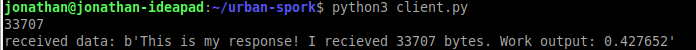

# I did a thing!

Four python scripts are included here:
* server.py - this hosts a localhost (for now) TCP server that recieves a JSON encoded list that contains the raw sample values from the chair
* client.py - this pings an example JSON packet to the TCP server (again over localhost) - this simlates the mobile app
* training_script.py - This takes a data input .csv (default here is pima-indians-diabetes.csv from -->> http://archive.ics.uci.edu/ml/machine-learning-databases/pima-indians-diabetes/) and trains a 3 layer network on the data - the model is saved as 2 files called model.nn and model.h5
* evaluation_script.py - script to test the generated model files

Currently the following sequence is possible:
* Client connects to server
* Client sends JSON data packet to server
* Server loads NNet, processes the input data and passes it through the network
* Server returns the output from the nnet to the client
* Client closes connection

